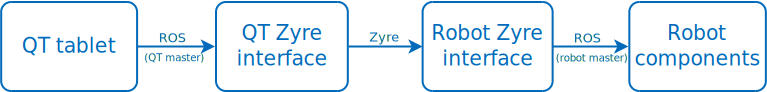

# mas_qt_tablet_interface

Interface for sending commands from the QT tablets to another robot.

The interface uses [Zyre](https://github.com/zeromq/zyre) components developed in the [ROPOD project](https://github.com/ropod-project) to establish communication between the QT tablets, which interact with a ROS master running on the QTrobot, and another robot that has its own ROS master running. The communication between the different components is illustrated in the diagram below.



## Setup

1. Clone this repository in a catkin workspace:
```
git clone https://github.com/migrave/mas_qt_tablet_interface.git
```
2. Install the Python requirements; for this, run the following command inside the package directory:
```
pip3 install -r requirements.txt --user
```
3. Build the package:
```
catkin build --this
```

## Usage (Toyota HSR)

1. On the QTrobot, kill the QT interface so that the robot doesn't respond to commands from the tablets
2. Run a substitute interface that interacts with the tablets. For this, connect a machine that should interact with the tablets to the QT wifi network, export the `ROS_MASTER_URI` of QTrobot, and run
```
roslaunch mas_qt_tablet_interface qt_tablet_interface.launch
```
3. Connect the HSR to the QT wifi network and run
```
roslaunch mas_qt_tablet_interface hsr_qt_tablet_interface.launch
```

To use the interface with a different robot, create another launch file with the name `[robot]_qt_tablet_interface.launch` and update the values of the launch file arguments accordingly.
